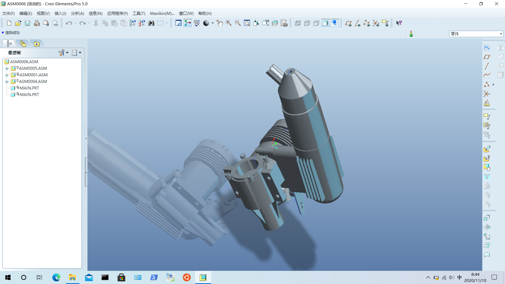
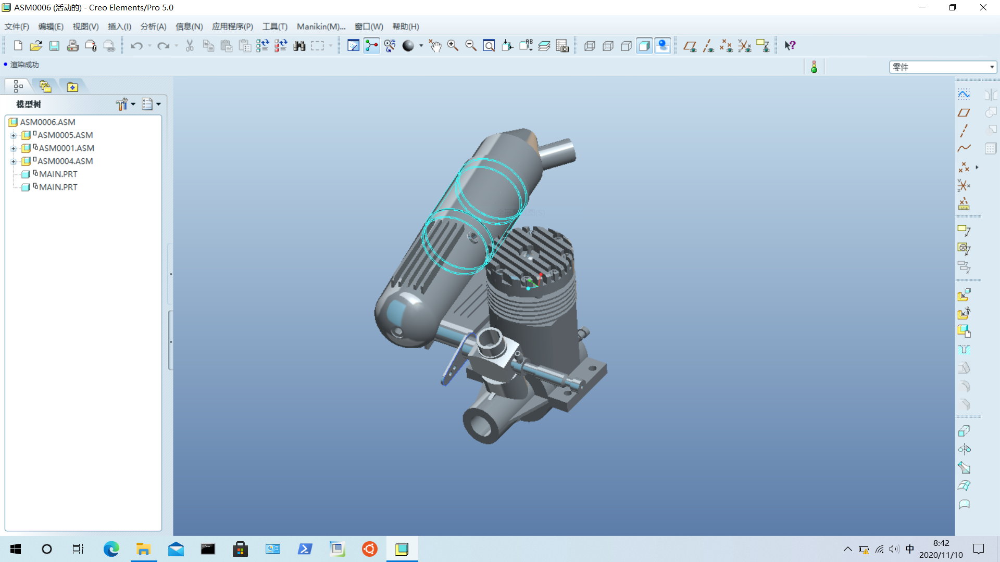

## *This is a general assembly data for pro/e 5.0*

这是目录
motor
├── 1
│   ├── 1_1.prt.1
│   ├── 1_2.prt.1
│   ├── 1_3.prt.1
│   ├── 1_4.prt.1
│   └── asm0001.asm.1
├── 2
│   ├── 2_1.prt.1
│   ├── 2_2.prt.1
│   ├── 2_3.prt.1
│   ├── 2_4.prt.1
│   ├── 2_5.prt.1
│   ├── asm0004.asm.1
│   └── asm0004.asm.2
├── 3
│   ├── 3_1.prt.1
│   ├── 3_2.prt.1
│   ├── 3_3.prt.1
│   ├── 3_4.prt.1
│   ├── 3_5.prt.1
│   ├── asm0005.asm.1
│   └── asm0005.asm.2
├── asm0006.asm.1
├── asm0006.asm.2
├── asm0006.asm.3
├── main.prt.1
├── std.err
├── std.out
├── trail.txt.1
├── trail.txt.2
└── trail.txt.3

​		这是效果图改进。

